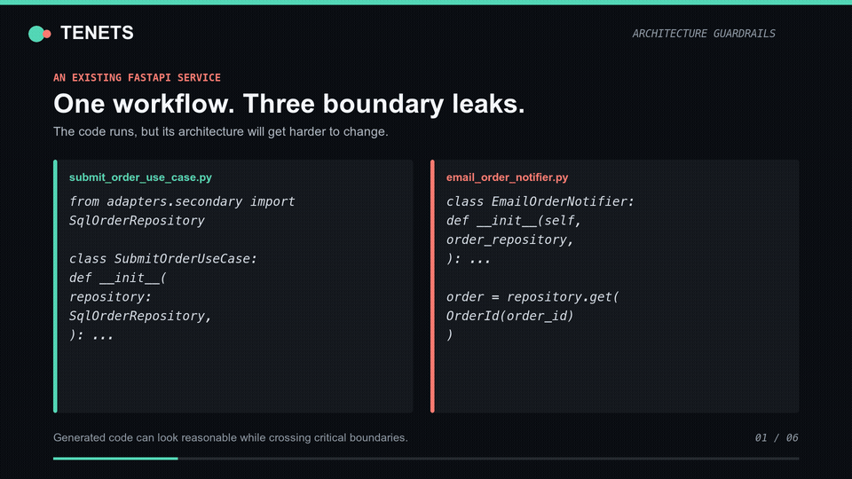

# Tenets

**Architecture guardrails for AI coding agents building backend services with
Domain-Driven Design and Hexagonal Architecture.**

Tenets installs versioned, repository-local guidance for Claude Code, Cursor,
Augment, GitHub Copilot, and other agents. The same rules guide generation,
architecture review, and remediation:

```text
Specify -> Generate -> Review -> Explain
```

## See It Work

[](docs/assets/tenets-demo.mp4)

This reproducible demo installs Tenets into an existing FastAPI service, reviews
one workflow, reports three boundary violations with stable rule IDs, and
explains how to fix one of them. Inspect the
[fixture](examples/architecture-review-demo/) and
[demo source](demo/act-009/) to verify every displayed claim.

## The Problem

AI agents can generate an entire backend feature before a reviewer has time to
establish its architectural boundaries. Plausible code can still:

- Import infrastructure into application or domain code.
- Put workflow orchestration inside adapters.
- Pass primitive or persistence-shaped data across domain boundaries.
- Create inconsistent patterns from one feature to the next.
- Make a large generated change expensive to review and maintain.

Repeated prompting does not create a durable engineering standard. Tenets puts
the standard in the repository, gives it stable identifiers, and delivers the
relevant guidance where each supported agent already looks.

## Quick Start

Run Tenets from the repository you want to configure:

```bash
npx tenets init
```

Tenets detects your coding agents, language, framework, repository layout,
existing agent files, and Spec-Kit installation. Accept the recommended setup
or select the integrations you want. Initialization ends by verifying every
installed integration.

For CI or other noninteractive environments:

```bash
npx tenets init --yes --json
```

### Initialize The Service

For an empty repository or an enterprise Flask starter:

```text
/tenets-scaffold
```

Use the installed `.tenets/prompts/tenets-scaffold.md` directly with generic
agents that do not expose repository slash commands.

The agent inspects the repository and classifies it as `greenfield`,
`enterprise_starter`, or `active_service`. It presents the evidence and a
complete file-and-edit plan before writing anything:

- Greenfield repositories receive the canonical runnable Flask foundation.
- Enterprise starters preserve existing platform conventions and receive an
  adapted, additive architecture plan.
- Active services are not reorganized; the command stops and recommends a
  scoped assessment.

The command never moves, renames, or deletes existing files. Every edit to an
enterprise-owned file requires explicit approval. Scaffolded application code
is user-owned: `tenets update` refreshes the agent workflow, and
`tenets uninstall` does not remove the service it created.

### Build The First Workflow

For a new workflow, ask the agent to establish the domain boundary before
generating implementation details:

```text
Implement order submission using the installed Tenets rules.
First define the bounded context, domain language, use case, ports,
and adapter responsibilities. Then implement and test one complete workflow.
```

In an established service, start with one changed workflow or bounded context.
Do not ask the agent to reorganize the entire repository in one pass.

### Review One Boundary

In tools with slash-command support:

```text
/tenets-review-architecture src/ordering
```

The review reports exact files, severity, active Tenets rule IDs, and concrete
remediation. Generic agents receive the same workflow as a repository prompt.

Inspect any finding offline:

```bash
npx tenets explain TENETS-PORT-005
npx tenets explain TENETS-PORT-005 --json
```

## What Tenets Adds

| Workflow stage | Tenets contribution |
| --- | --- |
| Specify | Optional Spec-Kit templates introduce domain language, bounded contexts, architecture checks, and implementation ordering before code generation |
| Generate | Context-aware rules teach the agent how this repository expects domains, use cases, ports, adapters, transactions, events, and tests to be structured |
| Review | One shared architecture-review contract finds boundary violations and cites stable rule IDs |
| Enforce | Selectable profiles and optional review-agent hooks keep the active policy consistent during implementation |
| Explain | `tenets explain` returns canonical rationale, incorrect and correct examples, remediation, and a review check without network access |

The current product enforces architecture through agent context and review
workflows. Deterministic source analysis and CI enforcement are part of the
planned architecture-quality loop.

## Choose Your Commitment

Fresh installations use the `pragmatic` profile.

| Profile | Intended use |
| --- | --- |
| `core` | Essential dependency direction and domain-boundary rules |
| `pragmatic` | Recommended production baseline with practical implementation guidance |
| `strict` | Complete applicable catalog for teams standardizing deeply on the architecture |

```bash
npx tenets init --profile core
npx tenets update --profile strict
```

Profiles control both the knowledge delivered to agents and the rules an
architecture review may enforce. See
[Architecture Profiles](docs/architecture-profiles.md).

## Supported Integrations

Zero-argument initialization recommends integrations based on the repository.
Explicit flags can be combined when needed:

```bash
npx tenets init --claude --speckit
```

| Tool | Explicit flag | Installed workflow |
| --- | --- | --- |
| Claude Code | `--claude` | Context-aware rules, `CLAUDE.md` guidance, review and scaffold skills, optional monitoring hook |
| Cursor | `--cursor` | Always-on and path-scoped rules plus review and scaffold commands |
| Augment | `--augment` | Repository rules plus review and scaffold commands |
| GitHub Copilot | `--copilot` | Global and path-scoped instructions plus review and scaffold prompts |
| Generic agents | `--agents` | Portable `AGENTS.md` guidance plus review and scaffold prompts |
| Code review agent | `--code-review-agent` | Standalone structured reviewer contract |
| Spec-Kit | `--speckit` | DDD and Hexagonal Architecture planning preset |

See [Agent and Spec-Kit Integrations](docs/integrations.md) for installed paths,
tool-specific behavior, review invocation, Claude hooks, and Spec-Kit setup.

## Safe By Default

Tenets is designed to coexist with repository and enterprise-owned
configuration:

- `--dry-run` and `tenets diff` show exact filesystem changes before applying
  them.
- Generated files carry ownership markers; shared files are edited only inside
  explicit Tenets markers.
- Unowned conflicts stop noninteractive updates instead of being overwritten.
- `tenets uninstall` removes only Tenets-owned files and marked content.
- Package-bundled rules make installation and updates versioned, deterministic,
  and available offline.

```bash
npx tenets init --cursor --dry-run
npx tenets diff
npx tenets doctor
npx tenets uninstall --dry-run
```

See the [changelog](CHANGELOG.md) and
[migration notes](docs/migrations.md) before upgrading across output-format
changes.

## Command Reference

| Command | Purpose |
| --- | --- |
| `npx tenets init` | Detect the repository and install a recommended setup |
| `npx tenets init --yes --json` | Initialize noninteractively with machine-readable output |
| `npx tenets doctor` | Diagnose missing, stale, conflicting, or undiscoverable integrations |
| `npx tenets diff` | Preview the exact changes from the next update |
| `npx tenets update` | Refresh every configured integration from the installed package version |
| `npx tenets update --profile strict` | Change profile and regenerate configured integrations |
| `npx tenets explain <rule-id>` | Read canonical guidance for a finding |
| `npx tenets uninstall --dry-run` | Preview ownership-safe removal |
| `npx tenets uninstall --yes` | Remove configured Tenets integrations |
| `npx tenets --version` | Print the installed CLI version |

## What The Rules Cover

The canonical knowledge base currently focuses on Python backend services:

- **Architecture:** dependency direction, ports, adapters, configuration,
  integration flow, replaceability, and API boundaries.
- **Domain:** entities, value objects, aggregates, services, repositories,
  events, bounded contexts, language, creation, and hydration.
- **Application:** use cases, orchestration, secondary-port data flow,
  cross-context communication, transactions, and event integration.
- **Cross-cutting:** project structure, errors, naming, testing, idempotency,
  and architecture decisions.

Rules and reusable patterns are authored once under [`knowledge/`](knowledge/)
and compiled into agent-specific views. Stable IDs allow reviews, profiles, and
future automation to refer to policy without duplicating it.

## Current Scope

Tenets is most useful when a backend has meaningful business behavior and
benefits from explicit domain and infrastructure boundaries. It is intentionally
opinionated, and not every CRUD service needs every DDD pattern.

Concrete implementations currently target Python. Contributions for additional
languages should preserve the same architectural meaning rather than translate
examples mechanically.

## Documentation

- [Agent and Spec-Kit Integrations](docs/integrations.md)
- [Architecture Profiles](docs/architecture-profiles.md)
- [Knowledge Authoring](docs/knowledge-authoring.md)
- [Migration Notes](docs/migrations.md)
- [Changelog](CHANGELOG.md)
- [Reproducible Demo](demo/act-009/)

## Contributing

Tenets welcomes rule clarifications, implementation patterns, realistic
examples, architecture evaluation tasks, and language-pack expertise. Read
[CONTRIBUTING.md](CONTRIBUTING.md) before changing canonical knowledge or
generated views.

## License

MIT License. See [LICENSE](LICENSE).
